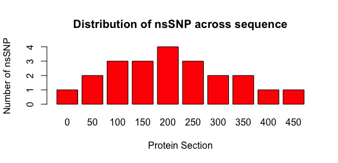

```{r, include = FALSE}
knitr::opts_chunk$set(
  collapse = TRUE,
  comment = "#>"
)
```


## Summary

**snpCYP** is an R package to streamline and automate the process of reading and analyzing nonsynonymous single nucleotide polymorphisms (SNP) on CYP genes. It is supposed to allow for easier exploratory analysis by graphically outputting the nsSNP distribution and their potential disruptions on drug metabolism by correlating the SNPs to known or predicted catalytic activity from PolyPhen-2 and DIDB databases. 

**This document gives a tour of snpCYP (version 0.1.9001)**. 
It was written in R Markdown, using the [knitr](https://cran.r-project.org/package=knitr) package for production. See `help(package = "snpCYP")` for further details. 

To download **snpCYP**, use the following commands:
``` {r eval=FALSE}
require("devtools")
install_github("a.albuquerque/snpCYP", build_vignettes = TRUE)
library("snpCYP")
```

To list all sample functions available in the package:
``` {r eval=FALSE}
ls("package:snpCYP")
```

To list all sample datasets available in the package:
``` {r eval=FALSE}
data(package = "snpCYP")
```

<br>

## Functions

More details about the 4 functions available:

### 1. detectSNP

#### Summary of the function

**detectSNP** is a function to facilitate detection of nsSNP when the protein 
sequence of the clinically relevant CYP are available (CYP1A2, CYP2B6, CYP2C8,
CYP2C9, CYP2C19, CYP2D6, CYP3A4). It compares each aminoacid on the sequence
in each of the sequences to the canonical wide-type sequence at UniProtKB.

#### How to use the function

**Parameter Format**

The function receives a list of sequences of any one of the CYPs above and
a list of the corresponding canonical name of the isoform also as above. Both
must be lists of string.. list of CYPs to be analyzed, list of strings.

The function will then plot each of the CYP provided and compare then with
respect of the frequency of nsSNP at each.

**Example of Using the Function**

In the following example, we are providing 2 sequences from the same individual
(artificial), corresponding to isoforms 1A2 and 2B6.

``` {r eval=FALSE}
load(file = "./data/baseSeqs.rda")
detectSNP(list("CYP1A2", "CYP2B6"),
           list(paste("ASASQSVPFSATELLLASAIFCLVFWVLKGLRPRVPKGLKSPPEPWGWPLLGHVLTLGKN",
                      "PHLALSRMSQRYGDVLQIRIGSTPVLVLSRLDTIRQALVRQGDDFKGRPDLYTSTLITDG",
                      "QSLTFSTDSGPVWAARRRLAQNALNTFSIASDPASSSSCYLEEHVSKEAKALISRLQELM",
                      "AGPGHFDPYNQVVVSVANVIGAMCFGQHFPESSDEMLSLVKNTHEFVETASSGNPLDFFP",
                      "ILRYLPNPALQRFKAFNQRFLWFLQKTVQEHYQDFDKNSVRDITGALFKHSKKGPRASGN",
                      "LIPQEKIVNLVNDIFGAGFDTVTTAISWSLMYLVTKPEIQRKIQKELDTVIGRERRPRLS",
                      "DRPQLPYLEAFILETFRHSSFLPFTIPHSTTRDTTLNGFYIPKKCCVFVNQWQVNHDPEL",
                      "WEDPSEFRPERFLTADGTAINKPLSEKMMLFGMGKRRCIGEVLAKWEIFLFLAILLQQLE",
                      "FSVPPGVKVDLTPIYGLTMKHARCEHVQARLRFSIN", sep=""), paste("MEL",
                       "SVLLFLALLTGLLLLLVQRHPNTHDRLPPGPRPLPLLGNLLQMDRRGLLKSFLRFRE",
                       "KYGDVFTVHLGPRPVVMLCGVEAIREALVDKAEAFSGRGKIAMVDPFFRGYGVIFANGNR",
                       "WKVLRRFSVTTMRDFGMGKRSVEERIQEEAQCLIEELRKSKGALMDPTFLFQSITANIIC",
                       "SIVFGKRFHYQDQEFLKMLNLFYQTFSLISSVFGQLFELFSGFLKYFPGAHRQVYKNLQE",
                       "INAYIGHSVEKHRETLDPSAPKDLIDTYLLHMEKEKSNAHSENAHQNLNLNTLSLFFAGT",
                       "ETTSTTLRYGFLLMLKYPHVAERVYREIEQVIGPHRPPELHDRAKMPYTEAVIYEIQRFS",
                       "DLLPMGVPHIVTQHTSFRGYIIPKDTEVFLILSTALHDPHYFEKPDAFNPDHFLDANGAL",
                      "KKTEAFIPFSLGKRICLGEGIARAELFLFFTTILQNFSMASPVAPEDIDLTPQECGVGKI",
                      "PPTYQIRFLPR", sep="")))
```


The example would generate the comparison of 2 isoforms only (for simplicity) 
but the function would display all the isoforms and their nsSNP frequencies if
provided. The function also returns a vector describing the SNP locations:
[1] "CYP1A2" "1" "CYP1A2" "2" "CYP1A2" "3" "CYP2B6" "283" "CYP2B6" "284"

### 2. snpDist

#### Summary of the function

**snpDist** creates a graphic output of the frequency of nsSNPs for each region
of the provided CYP isoform protein. The regions are divided in groups of 
50 residues.

#### How to use the function

**Parameter Format / Examples**

The parameters include the CYP isoform name to be analyzed (i.e. a string
among CYP1A2, CYP2B6, CYP2C8, CYP2C9, CYP2C19, CYP2D6 and CYP3A4), and the 
aminoacid sequence (one-letter code) of the corresponding CYP isoform. 

**Example of Using the Function**

We will use now call to the function providing an artificial sequence
for the isoform 1A2:

```{r eval=FALSE}
load(file = "./data/baseSeqs.rda")
snpDist("CYP1A2",
paste("AALSQSVPFSATELLLASAIFCLVFWVLKGLRPRVPKGLKSPPEPWGWPLLGHVLTLGKN",
"LALALSRMSQRYGDVLQIRIGSTPVLVLSRLDTIRQALVRQGDDFKGRPDLYTSTLITDG",
"TFSTFSTDSGPVWAARRRLAQNALNTFSIASDPASSSSCYLEEHVSKEAKALISRLQELM",
"GHFGHFDPYNQVVVSVANVIGAMCFGQHFPESSDEMLSLVKNTHEFVETASSGNPLDFFP",
"PNPALPNPALQRFKAFNQRFLWFLQKTVQEHYQKNSKNSVRDITGALFKHSKKGPRASGN",
"PQPQEKIVNLVNDIFGAGFDTVTTAISWSLMYLVTKPEIQRKIQKELDTVIGRERRPRLS",
"PQPQLPYLEAFILETFRHSSFLPFTIPHSTTRDTTLNGFYIPKKCCVFVNQWQVNHDPEL",
"EEDPSEFRPERFLTADGTAINKPLSEKMMLFGMGKRRCIGEVLAKWEIFLFLAILLQQLE",
"SSVPPGVKVDLTPIYGLTMKHARCEHVQARLRFSIN", sep=""))
```

{width=90%}

The function return a visualization of the frequency of nsSNPs for each protein 
region and also a vector with the SNPs count for each region:

  0  50 100 150 200 250 300 350 400 450 
  1   2   3   3   4   3   2   2   1   1 

### 3. snpToDrug

#### Summary of the function

**snpToDrug** outputs drugs in clinical use of which metabolism would be 
potentially disrupted by a critical SNP. The correlation data is sourced
from the following:

Drug interaction guideline for drug development and labeling recommendations
European Medicines Agency (2013). Guideline on the Investigation of Drug Interactions.

University of Washington Metabolism and Transport Drug Interaction Database 
[Hachad et al. (2010), Hum Genomics, 5(1):61]
        by a critical snp at the provided CYP isoform

#### How to use the function

**Parameter Format / Examples**

The parameter must be a string containing the canonical name of one of the
clinically relevant (according to above sources) CYP isoforms, i.e.
CYP1A2, CYP2B6, CYP2C8, CYP2C9, CYP2C19, CYP2D6, or CYP3A4, all provided
as a string.

**Example of Using the Function**

``` {r eval=FALSE}
load(file = "./data/drugs.rda")
snpToDrug("CYP1A2")
```

The function return a list of drug with the metabolism potentially disrupted:

CYP1A2 
"omeprazole, lansoprazole, caffeine, tizanidine, fluvoxamine, alosetron, 
duloxetine, melatonin, ramelteon, tasimelteon, tizanidine, clozapine, 
pirfenidone, ramosetron, theophylline, ciprofloxacin, enoxacin, fluvoxamine, 
methoxsalen, mexiletine , estrogen, acyclovir, allopurinol, cimetidine, 
peginterferon alpha-2a, piperine, zileuton, phenytoin, rifampin, ritonavir, 
tobaco, teriflunomide"


### 4. snpToPred

#### Summary of the function

**snpToPred** generates a prediction of the potential phenotypical damage a 
nsSNP may cause to metabolic activity of the corresponding CYP isoform.

It is supposed to generate a probabilistic prediction of disruption by probing
the Polyphen-2 server engine and databases, which in turn perform analysis
on the sequence, phylogenetic and structural information related to the
provided substitution. The function is not currently working and is under
construction. 

The function first inject the query to the Polyphen-2 batch server (even in the
case of one query only). The returning package contains the address (related
to the generated session ID) in which the results will be available.

The function should not be called more frequently than one every 60s due
to Polyphen-2 limitations to prevent abuse, including by blocking the 
client's ID. The user therefore should aggregate all queries into a .txt
file whose path is provided to the function.

The function is not currently (Nov 16th 2021) operational due to server
downtime at the moment and implementation failures.

The is supposed to return a probability of disruption (0 to 1) and the false 
positive and true negative rate associated.

#### How to use the function

**Parameter Format / Examples**

The first parameter, prot, is the UniProtKB identifier of the CYP isoform to be 
analyzed, provided as a string. The pos parameter indicates the position of the 
mutated residue polymorphism, also a string (!). aa1 corresponds to the original 
(or wild type) residue, single-letter code. Finally aa2 corresponds to the
mutant residue, also as single-letter code.

**Example of Using the Function**

In this example we are calling the function to query for the predicted
probability of CYP3A4 (Uniprot ID P08684) to present enzymatic disturbance
given it contains a substitution at the fourth position from Isoleucine
(I) to Glutamine (Q).

```{r eval=FALSE}
snpToPred("P08684", "4", "I", "Q")
```

The function is supposed to return:

prediction	 pph2_prob	  pph2_FPR	  pph2_TPR
             0.091        0.71        0.97


## Package References

[Albuquerque A. (2021) snpCYP: An R Package For
  BCB410H. Unpublished.](https://github.com/a-albuquerque/snpCYP)
  
This vignette format was inspired by Dianna Callister's production:
[McAllister, D. (2020) MethylExpress: An R Package For
  BCB410H. Unpublished.](https://github.com/diannamcallister/MethylExpress)

<br>

## Other References

Adzhubei, I., Jordan, D. M., & Sunyaev, S. R. (2013). Predicting
functional effect of human missense mutations using PolyPhen-2. Current
Protocols in Human Genetics, 76 (1), 7–20.

Banerjee, P., Dunkel, M., Kemmler, E., & Preissner, R. (2020).
SuperCYPsPred—a web server for the prediction of cytochrome activity.
Nucleic Acids Research, 48 (W1), W580–W585.

DIDB - the drug interaction database. (2021). In UW Drug Interaction
Solutions. Washinton University.
<https://www.druginteractionsolutions.org/solutions/drug-interaction-database/>

H. Wickham. ggplot2: Elegant Graphics for Data Analysis. Springer-Verlag
New York, 2016.

Rostkowski, M., Spjuth, O., & Rydberg, P. (2013). WhichCyp: Prediction
of cytochromes P450 inhibition. Bioinformatics, 29 (16), 2051–2052.

Wang, L.-L., Li, Y., & Zhou, S.-F. (2009). A bioinformatics approach for
the phenotype prediction of nonsynonymous single nucleotide
polymorphisms in human cytochromes P450. Drug Metabolism and
Disposition, 37 (5), 977–991.

Zhang, T., Zhou, Q., Pang, Y., Wang, Y., Jin, C., Huo, J., Liu, L. A., &
Wei, D. (2012). CYP-nsSNP: A specialized database focused on effect of
non-synonymous SNPs on function of CYPs. Interdisciplinary Sciences:
Computational Life Sciences, 4 (2), 83–89.

----

```{r}
sessionInfo()
```
